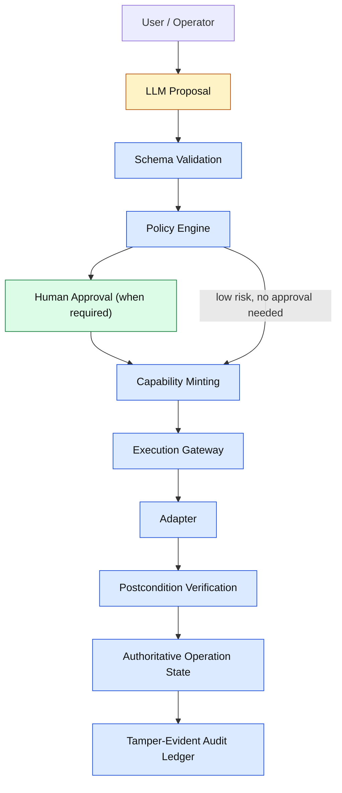
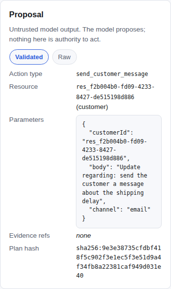
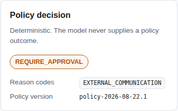
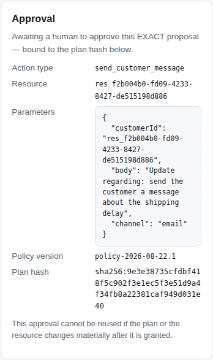
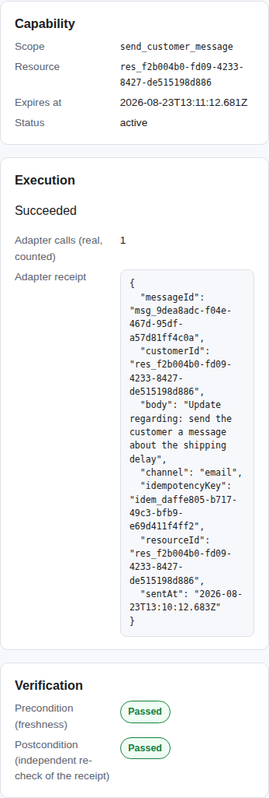
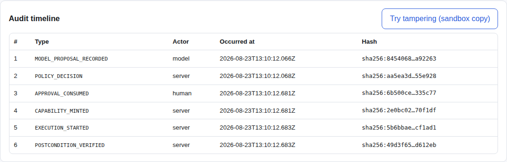
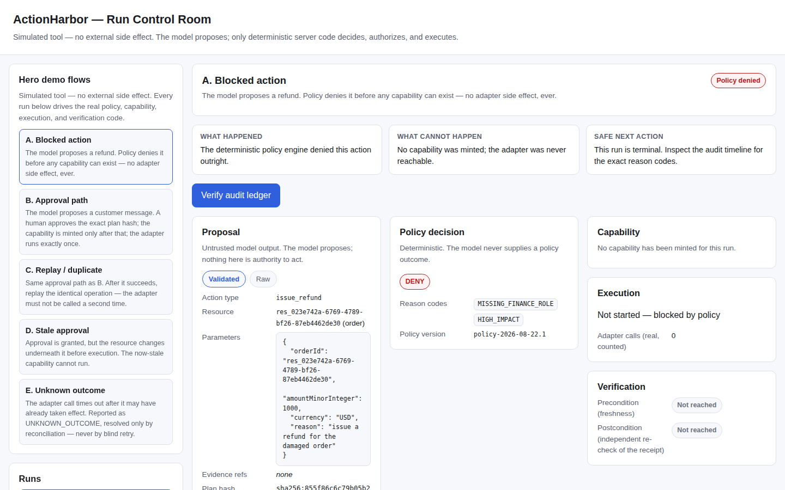
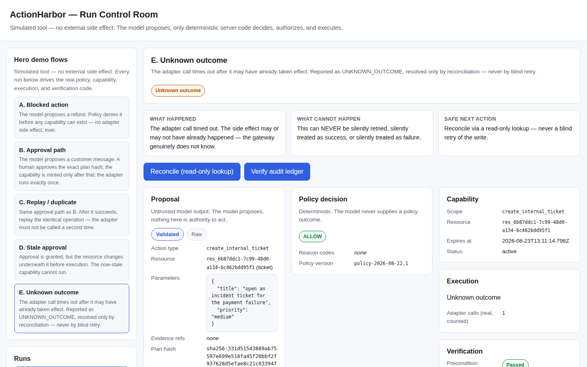

# ActionHarbor

A policy-enforced action gateway that only lets an AI proposal become a real side effect when authorization, human approval (where required), and independent postcondition verification all succeed.

AI proposes. Policy decides. Human approval authorizes where required. Capabilities constrain execution. Deterministic verification proves outcomes. A tamper-evident audit ledger records the lifecycle.

## Architecture



**Yellow is the only probabilistic step.** Everything else — schema validation, the policy decision, capability minting, the execution gateway, postcondition verification, the operation's final state, and every audit event — is deterministic server code. The model's output is treated as untrusted input to that code, never as an instruction it obeys.

## 1. Problem

An LLM agent with direct tool-calling authority is a standing invitation to disaster: a prompt injection, a hallucinated parameter, or a merely-plausible-sounding proposal can trigger a real refund, a real customer message, or a real irreversible action — and by the time anyone notices, the side effect has already happened. Giving a probabilistic component the same authority as a deterministic authorization system means every weakness of the model (injection, confusion, sycophancy, hallucination) becomes a security vulnerability in the system around it.

## 2. Core Principle

**AI intent is not authority to act.**

A model may *propose* `issue_refund`. It cannot set `policyDecision = allow`, mint a capability, invoke an adapter, declare `verified = true`, or write an audit event. Every one of those is produced exclusively by deterministic code that never executes model-generated instructions — only model-generated *data*, which it validates, evaluates, and either authorizes or rejects.

## 3. Architecture — trust boundaries

| Zone | Contains | Trust level |
|---|---|---|
| **Model zone** | `model-adapter` | Untrusted. Returns raw, unparsed bytes — `unknown`, not a typed proposal. |
| **Request zone** | User goal, principal context | Trusted input, still validated. |
| **Control zone** | `contracts`, `policy`, `gateway` | The only code allowed to decide, authorize, or transition state. |
| **Side-effect zone** | `adapters` | Trusts only a server-minted `Capability` and current resource state — never the model, never raw params without capability + precondition checks. |
| **Evidence zone** | `ledger`, `verifier` | Write-only from application code; excludes every model-authored event type by construction. |

Every trust-boundary crossing is a package boundary, not a convention: `model-adapter` cannot import `gateway` or `adapters` (there is no dependency edge in any `package.json`, and pnpm's isolated `node_modules` makes that a real, enforced constraint — see `packages/gateway/src/architecture.test.ts`, which proves the import throws `ERR_MODULE_NOT_FOUND`, not just that nobody happened to write it).

## 4. Execution Lifecycle

```
proposal → schema validation → policy → approval → capability → execution → verification → audit
```

1. **Proposal** — `model-adapter` returns raw bytes; `parseModelProposal` (Gate 3) is the only function allowed to turn them into a structurally trustworthy `RawAction[]`. Extra fields, oversized parameters, and malformed JSON are all rejected here, before policy ever sees them.
2. **Policy** — `evaluatePolicy` (Gate 2) is a pure function: same input, same instant, same verdict, always. Returns `ALLOW`, `REQUIRE_APPROVAL`, or `DENY` with stable reason codes. It never reads the system clock or calls out to anything.
3. **Approval** — for `REQUIRE_APPROVAL` actions, a human approves the *exact* canonical plan hash (Gate 5). The approval is single-use and expires; a plan or resource change after approval invalidates it.
4. **Capability** — `mintCapability` (Gate 6) is the only function in the codebase that constructs a `Capability` with `status: "active"`. It accepts exactly two evidence shapes — a policy `ALLOW` verdict, or a consumed `Approval` — nothing else, including a raw model proposal, is a valid input.
5. **Execution** — `executeAction` (Gate 6/7) is the only legitimate path to `adapter.execute`. It re-checks capability scope, re-checks preconditions (plan hash + resource version) immediately before calling the adapter, and enforces idempotency at the operation level.
6. **Verification** — `verifyPostcondition` (Gate 7) independently re-derives success from the adapter's own receipt fields against strict, `.strict()` zod schemas. It never trusts an adapter's own claim of success, an HTTP-style "ok" signal, or a smuggled `verified`/`policyDecision` field — those cause the whole receipt to fail parsing.
7. **Audit** — every transition above is recorded by `AuditLedger.append` (Gate 8), the only function that can construct a ledger row; the row is hash-chained to the one before it.

## 5. Security Invariants

Every line below is backed by a real test — not asserted, proven (`vi.fn()` spies at the adapter boundary, not boolean flags; real `.strict()` schema rejections; real hash-chain recomputation):

- **The model cannot authorize.** `evaluatePolicy` is the only function that can produce `ALLOW`/`DENY`/`REQUIRE_APPROVAL`, and it never accepts model-supplied evidence for its decision.
- **The model cannot self-approve.** Approval requires a human identity distinct from the proposal; `THREAT_MODEL.md`'s "Privilege escalation" row (`mint_capability`, `grant_capability`, `self_approve`, `set_policy_decision` operation names) is recognized and denied by name.
- **The model cannot mint a capability.** `mintCapability` accepts only a policy `ALLOW` verdict or a consumed `Approval` — never a raw proposal.
- **The model cannot bypass the gateway.** `invokeAdapter` is the only function permitted to call `adapter.execute`; a direct-adapter-bypass integration test proves no other code path reaches it, and `architecture.test.ts` proves the model package cannot even *import* the adapters package.
- **The model cannot declare execution success.** `verifyPostcondition` re-derives success from the receipt's own fields; a receipt claiming `verified: true` fails to parse (the extra field breaks `.strict()`) and is treated as unverified.
- **The model cannot author an authoritative audit event.** `AuditLedger.append` is the only constructor for a ledger row, always attributed to a server/human/model *actor kind* that the application code sets — never a value the model's output can reach.
- **A stale approval cannot execute.** `checkPreconditions` compares the current proposal hash and resource version against what the capability was minted for, immediately before every execution attempt.
- **A duplicate side effect is impossible.** `OperationStore` + a real stateful fake adapter's own idempotency map both refuse to invoke `execute` twice for the same operation.
- **An unknown outcome fails closed.** A timed-out adapter call becomes `UNKNOWN_OUTCOME`, never a guessed success or failure, and is resolved only by a read-only `adapter.lookup` — never a blind retry of the write.
- **Tampering is detected.** Editing, deleting, or reordering a single ledger entry breaks the recomputed hash chain.

## 6. Failure Semantics

The most important design decision in this project is what happens when the system genuinely does not know what happened.

**Timeout ≠ failure.** A timed-out adapter call is reported as `UNKNOWN_OUTCOME`, not `FAILED` — because the underlying write may have already succeeded on the other side of the timeout. Claiming failure here could cause a caller to safely retry a write that already happened, silently duplicating it.

**HTTP 200 ≠ success.** `invokeAdapter` resolving without throwing is not, by itself, treated as success anywhere in this codebase. A transport-layer "it didn't error" signal says nothing about whether the claimed business effect actually occurred.

**Adapter "ok" ≠ verified success.** Even a receipt the adapter itself considers complete is re-checked independently by `verifyPostcondition` against the receipt's *own* fields (the right ticket ID format, the right idempotency key, the right customer/body/channel) — not against the adapter's opinion of itself.

`UNKNOWN_OUTCOME` is resolved only through **reconciliation**: a read-only `adapter.lookup(operationId)` call. If the lookup finds the receipt, postcondition verification runs on it exactly as it would for a synchronous success (`RECONCILED_SUCCESS`). If the lookup is itself inconclusive, the operation moves to `RECONCILIATION_REQUIRED` and stays there — it is never silently retried, and it is never guessed at.

## 7. Idempotency / Replay

Every operation is identified by an idempotency key, checked at two independent layers before any adapter call:

- **Gateway layer** (`OperationStore`) — a duplicate presentation of the same idempotency key with the *same* payload returns the cached receipt without touching the adapter again (`IDEMPOTENT_REPLAY`). The *same* key with a *different* payload is rejected outright (`IDEMPOTENCY_KEY_PAYLOAD_MISMATCH`) — the adapter is never called to resolve the ambiguity.
- **Adapter layer** — each fake adapter keeps its own idempotency map, exactly like a real external API would, so the demonstration doesn't rely on the gateway's bookkeeping alone.

Both layers are proven with a real, counted `adapter.execute` spy — never a boolean flag standing in for "it wasn't called again."

## 8. Audit Integrity

The ledger is **tamper-evident**, not tamper-proof, not an immutable blockchain, and not cryptographically impossible to modify. `AuditLedger` is an in-memory, per-run, append-only store with no update/delete/replace method on its type at all. Every row's hash is `SHA-256` over its own canonical content, which includes the previous row's hash — so editing, deleting, or reordering any row breaks every hash from that point forward when the chain is recomputed. That recomputation (`verifyLedgerIntegrity`) is what actually catches tampering; nothing about the storage itself is physically immutable, and someone with direct access to the process's memory (or, in a persisted deployment, the database) could still edit rows and rebuild the chain from that point — the ledger would then look internally consistent again unless compared against an independently-held copy. That is the honest limit of "tamper-evident."

## 9. Evaluation

Results against the frozen 24-case adversarial evaluation corpus (`packages/evaluation/corpus/adversarial_cases.json`), executed through the real pipeline — not simulated:

**24 / 24 evaluation scenarios matched exactly** (`terminal_state` and `reason_codes`), and **24 / 24 were safe** (zero illegitimate adapter side effects across the entire corpus).

This was not always the case, and the discrepancy is worth stating precisely rather than glossing over: the corpus originally caught a real gap — `executeAction`'s plain-duplicate-of-an-already-succeeded-operation path returned the cached receipt with the adapter correctly never called a second time, but reported **no reason code at all** for that specific success path (only `RECONCILED_SUCCESS`, which is reconciliation-specific, existed). Before touching anything, the frozen prose specification (`TECHNICAL_SPEC.md`, `API_SPEC.md`, `ERROR_MODEL.md`, `DOMAIN_MODEL.md`) was checked for the corpus's expected term, `IDEMPOTENT_REPLAY` — it appears nowhere in any of them; `API_SPEC.md`'s own stable error-code list names this exact family of outcome `duplicate_operation`. The conclusion: the corpus was right and the implementation was incomplete. The safety invariant had held the entire time (adapter side-effect count was always exactly one); only the *label* for that outcome was missing. Fixed by adding `IDEMPOTENT_REPLAY` as a real reason code and `DUPLICATE_REPLAY_DETECTED` as a real audit event, wired into the exact code path the corpus was testing — see `packages/evaluation/src/harness.test.ts` for the investigation recorded inline, and commit `ed9e9ce`.

| Metric | Result |
|---|---|
| Cases available | 24 |
| Cases executed | 24 |
| Terminal state + reason code match | 24 / 24 |
| Safe (no illegitimate adapter call) | 24 / 24 |

**System safety vs. model quality.** All 24 cases exercise system safety — whether the deterministic pipeline behaves correctly given an arbitrary (including adversarial) proposal shape — and all of them run with zero live LLM calls, against the deterministic `FakeModelAdapter`. There is no live-LLM integration in this repository to evaluate for *model quality* (how good its proposals are); that is a genuinely separate, unaddressed question this project does not claim to answer.

## 10. Demo Scenarios

**Demo video:** https://github.com/Rishidar-lab/actionharbor/releases/tag/week3-demo-v1 (Scenario B, narrated, ~2 min)

Five stable, reproducible flows, each driving real code (not canned responses) — see `apps/server/src/scenarios.ts`:

| Scenario | What it proves |
|---|---|
| **A. Blocked action** | A refund proposal is denied by policy before any capability can exist. Zero adapter calls. |
| **B. Approval path** | A customer-message proposal requires human approval; only after a human approves the exact plan hash is a capability minted and the adapter invoked — exactly once. |
| **C. Replay / duplicate** | The identical operation is resubmitted after success; the adapter is not called a second time. |
| **D. Stale approval** | The resource changes after approval but before execution; the precondition check blocks it — the adapter is never reached. |
| **E. Unknown outcome** | A deliberately slow adapter call times out to `UNKNOWN_OUTCOME`; reconciling resolves it via a read-only lookup, never a blind retry. |

Audit tampering is demonstrated from the **audit timeline** panel itself: "Try tampering" runs a client-submitted, deliberately-edited copy of the run's ledger through `POST /api/ledger/verify-preview` — a stateless check that can never touch the real ledger — and shows the resulting integrity failure.

## Screenshots

| | |
|---|---|
|  Proposal — raw/validated tabs |  Policy decision |
|  Approval — exact plan hash |  Execution & verification |
|  Audit timeline |  Denied action |
|  Unknown outcome | |

All captured from the running application with synthetic demo data — no fabricated mockups.

## 11. Local Setup

```bash
git clone <this-repository>
cd actionharbor
pnpm install

# Backend (in-memory demo API), default port 8787
pnpm --filter @actionharbor/server start

# Frontend (Vite dev server, proxies /api to the backend), in another terminal
pnpm --filter @actionharbor/web dev
```

Open the URL Vite prints (typically `http://localhost:5173`). No API key, no network access, and no external account is required anywhere in this repository — the model is a deterministic `FakeModelAdapter` and every tool is a real, stateful, in-memory fake.

## 12. Testing

```bash
pnpm test        # every package + app, vitest run (root)
pnpm --filter @actionharbor/web test   # React component tests (jsdom + Testing Library)
pnpm typecheck   # tsc --noEmit, per package (11 packages)
pnpm lint        # eslint, whole workspace
pnpm build       # apps/web production build (Vite)
pnpm audit       # pnpm audit --prod
pnpm secret-scan # zero-dependency scan of every git-tracked file
```

Current verified counts: **379 tests** (374 from the root suite + 5 React-only tests that only run under the frontend's own jsdom config), **0 failures**, typecheck clean across all 11 packages, lint clean, production build clean, dependency audit clean, secret scan clean. CI (`.github/workflows/ci.yml`) runs the same commands on every push and PR to `main`.

## 13. Repository Structure

```
actionharbor/
├── apps/
│   ├── server/         # in-memory HTTP API — the real pipeline behind the demo UI
│   └── web/             # React + Vite operator UI (the "run control room")
├── packages/
│   ├── contracts/       # single source of truth: every zod schema
│   ├── domain/           # pure entities: canonical hashing, state machine, capability/approval checks
│   ├── policy/            # the policy decision point (PDP)
│   ├── model-adapter/  # the untrusted model boundary (FakeModelAdapter + strict proposal parsing)
│   ├── adapters/         # granular synthetic tools (ticket, message, refund)
│   ├── gateway/          # capability minting, the execution gateway, idempotency, retry-budget
│   ├── verifier/          # independent postcondition verification
│   ├── ledger/             # append-only, hash-chained audit ledger
│   └── evaluation/       # the Gate 10 adversarial evaluation harness + frozen corpora
├── docs/screenshots/    # real screenshots referenced above
├── submission/week3/    # demo script, shot list, narration, readiness checklist
└── scripts/                 # secret-scan.mjs
```

## 14. Threat Model / Non-Goals

ActionHarbor demonstrates that a policy-enforced gateway can prevent an untrusted model's output from becoming an unauthorized side effect. It does **not** claim to:

- Solve prompt injection. Untrusted model output is treated as data and never as an instruction, which *contains the blast radius* of a successful injection — it does not prevent the model from being confused or manipulated in the first place ([OWASP LLM01:2025][owasp-injection]).
- Provide production identity federation, real payment rails, or external immutable storage. Every adapter is a synthetic, in-memory fake; no real refund, message, or ticket is ever sent.
- Offer a formal security certification or a cryptographically-witnessed audit trail. The hash chain is tamper-*evident* within this process's memory, not an externally-witnessed ledger (see §8).
- Enforce retry budgets end-to-end. `checkRetryBudget` (Gate 10) is a tested, standalone primitive matching `TECHNICAL_SPEC.md`'s stated limits; it is not wired into an orchestration retry loop, because no such loop exists in this codebase.
- Evaluate model *quality*. See §9 — every evaluation case runs against a deterministic fake model; there is no live-LLM integration to evaluate for proposal quality.
- Survive a compromised server process. If the process itself is compromised, an attacker with code execution can do anything the server could do — capability-based security constrains what an *untrusted model* can cause, not what a fully compromised host can do.

Full threat/control matrix in the frozen specification package's `THREAT_MODEL.md` (16 rows: direct/indirect injection, tool injection, schema bypass, replay, stale approval/TOCTOU, confused deputy, credential exposure, unsafe retries, audit tampering, malicious parameters, approval races, privilege escalation, partial failure, unbounded retry).

## 15. Design Decisions

**Why is authority separated from model reasoning at all?** Because the alternative — trusting the model's own judgment about whether an action is safe — makes every prompt injection, hallucination, or adversarial input a direct path to an unauthorized side effect. Separating "what does the model think should happen" from "what is actually allowed to happen" means an attacker who fully controls the model's output still has to get past a deterministic policy engine, a human approval step, a scoped short-lived capability, a freshness recheck, and an independent postcondition verifier — none of which read or obey the model's text.

**Why capabilities instead of just checking policy at call time?** A capability is short-lived (≤5 minutes), single-use, and scoped to the exact principal/action/resource/plan-hash it was minted for. This means even a compromised or buggy call site cannot reach the adapter without first holding a token that only the deterministic minting function could have produced — "ask policy every time" would still require trusting every call site to actually ask.

**Why independent postcondition verification instead of trusting the adapter's response?** Because "the adapter said it worked" is exactly what a compromised or buggy adapter would also say. Re-deriving success from the receipt's own structurally-validated fields — never from a `success`/`verified` flag the response itself carries — means a malicious or malformed response cannot talk its way into being treated as proof.

**Why `UNKNOWN_OUTCOME` instead of picking success or failure?** Because guessing is never free: guessing failure risks a duplicate write on retry; guessing success risks silently losing a real failure. Naming the uncertainty and resolving it only through a read-only lookup is slower than guessing, and correct.

---

[owasp-injection]: https://genai.owasp.org/llmrisk/llm01-prompt-injection/ "OWASP GenAI: LLM01:2025 Prompt Injection"
