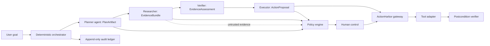

# Week 4 Handoff — ControlDeck

This is a **planning handoff only**. No Week 4 code has been written. Everything below is sourced from the frozen specification package (`AI_INTERNSHIP_W3_W4_MASTER.zip`, directories `05-week4/` and `06-week4-evaluation/`) that shipped alongside Week 3's own frozen spec — nothing here is invented. Items the source package itself marks as unresolved are labelled `UNKNOWN — REQUIRES SOURCE SPEC`, not guessed.

## 1. Week-4 objective

Build **ControlDeck**: "an auditable control plane where specialist agents propose evidence-backed work, but deterministic governance controls the transition from proposal to authorised action and independently verifies outcomes" (`05-week4/PRODUCT_SPEC.md`).

Synthetic use case: resolve a delivery incident. A Planner decomposes the request, a Researcher retrieves policy/order evidence, an Executor prepares a typed ActionHarbor action proposal, a Verifier checks evidence sufficiency/policy compliance/postconditions, a policy engine decides what may proceed, a human approves the exact plan, and a ledger records every artifact and transition. P0 scope is **one** deterministic workflow with 4-5 agents, a synthetic corpus, ActionHarbor gateway integration, explicit conflict/failure states, a replayable audit timeline, and two 90-120s demos.

Memorable framing from `05-week4/DEMO_PLAN.md`: **"Orchestration is safe only when composition cannot grant itself authority."**

## 2. Frozen requirements

**Confirmed and frozen** (from `05-week4/*.md`, the same tier of document that governed Week 3's build):

- Architecture, contracts, state machine, event schema, API surface, UX states, threat model, adversarial plan, evaluation plan, acceptance matrix, implementation sequence, and demo plan — all fully specified (see sections 3-10 below).
- A 30-case evaluation corpus (`06-week4-evaluation/evaluation_corpus.json`) and a 10-invariant definition set (`06-week4-evaluation/invariants.json`), each invariant requiring unit + integration + adversarial test coverage.

**UNKNOWN — REQUIRES SOURCE SPEC** (explicitly flagged as unresolved in the program-level planning material itself, `00-program/UNKNOWN_REQUIREMENTS.md` and `00-program/DEADLINES.md` — not something this handoff is guessing at):

- The exact, organiser-issued Week 4 task statement (whether multi-agent orchestration is actually mandatory, vs. this being the internal team's own chosen candidate).
- The official Week 4 rubric and weighting.
- The Week 4 due date and final submission cutoff/timezone (only the internship's overall public end date, 10 Sep 2026, is officially sourced; weekly deadlines were never recovered).
- The submission channel (GitHub / form / WhatsApp / portal).
- Whether Week 4 is expected as a second repository or folded into `actionharbor`.
- Whether live deployment is required.

**Decision rule inherited from the source package:** if an organiser message later conflicts with anything below, update this document and the acceptance matrix before writing any implementation code.

## 3. Architecture proposal already agreed upon

**Yes — ControlDeck was selected** from 5 candidates scored in `05-week4/CANDIDATE_ARCHITECTURES.md` (ControlDeck 4.80 vs. EvidenceCourt 4.15, AgentChangeBoard 4.00, DelegationGraph 4.25, IncidentMesh 4.35) — chosen because it "genuinely composes the prior boundaries: SourceLens-style evidence bundles, ShiftPilot-style human authority, ActionHarbor's gateway, and a new orchestration/governance boundary," rather than over-specializing or risking "agent-to-agent prompt theatre."

The control plane owns scheduling, state, invariants, snapshot identity, approval invalidation, retry budgets, and audit emission. Agents own only their typed artifact. **The model cannot call the orchestrator, alter workflow state, mint a capability, or write a ledger event** — the same shape of guarantee as ActionHarbor's Gate 0-8 invariants, one level up the stack.

## 4. Threat model

Full 12-row table in `05-week4/THREAT_MODEL.md`. Highlights, each with a named control:

| Threat | Control |
|---|---|
| Fake multi-agent theatre (planner output directly becomes execution) | Typed artifacts + orchestrator + ActionHarbor mediation |
| Evidence poisoning (researcher returns injected document instructions) | Evidence schema, source hashes, verifier, policy ignores instructions-as-content |
| Malicious agent output (executor claims an action already verified) | Executor cannot emit verification; verifier reads the receipt independently |
| Composition drift (agent asks for a new tool or sub-agent) | Contract manifest + composition attestation |
| Approval drift (evidence/plan changes after approval) | Snapshot/hash binding invalidates approval |
| Conflicting agents (two plans target incompatible resource versions) | `CONFLICT` state, resource versions, human resolution |
| Retry storm | Per-step budgets, circuit breaker, no retry on writes |
| Audit tampering | Server-only append API, hash chain, integrity freeze |
| Cross-tenant deputy | Principal/tenant checks at every boundary |

Security model summary (`05-week4/SECURITY_MODEL.md`): **"ControlDeck assumes any one model-backed agent may be compromised."** Blast radius is limited by separate tool scopes, no ambient credentials, immutable snapshots, strict artifact schemas, ActionHarbor mediation, approval binding, cumulative-risk policy, and an out-of-band ledger writer. Evidence is untrusted content, not instruction; tool output is untrusted data; cross-agent messages are not implicitly trusted just for coming from another agent.

## 5. Trust boundaries

From `05-week4/AUTHORITY_MODEL.md`: authority is a **chain** — human principal → workflow intent → policy decision → approval (when needed) → ActionHarbor capability → adapter execution. No agent can shorten the chain. Each agent role has *exactly one* kind of authority and no other:

| Agent | Authority | Explicitly forbidden |
|---|---|---|
| Planner | Planning only | Evidence claims, tool calls, approval, state mutation |
| Researcher | Retrieval only (read-only corpus) | Instructions-from-documents, actions, policy outcome |
| Executor | Proposal only (gateway client, no direct adapter) | Direct tool call, policy decision, approval, verification claim |
| Verifier | Assessment only (read-only state/receipt lookup) | Mutation, approval, success-without-checks |
| Policy engine | Decision only, pure code | Model calls, side effects, self-modification |
| Human control | The only actor that can approve a high-risk plan | — |

A capability (minted by ActionHarbor, not by ControlDeck) is bound to principal, tenant, action type, resource, **workflow id**, plan hash, policy version, expiry, and nonce — a superset of Week 3's capability, extended with workflow identity. It cannot be transferred between agents or reused for another resource.

## 6. Deterministic vs. probabilistic responsibilities

Exactly the same discipline as ActionHarbor, one layer higher:

- **Probabilistic (model-backed, untrusted):** Planner's `PlanArtifact`, Researcher's `EvidenceBundle`, Executor's `ActionProposal` content. A shared model is explicitly permitted for prototype cost control (`05-week4/AGENT_CONTRACTS.md`), but contracts, tool scopes, prompts, input artifacts, and output schemas stay separate and independently testable — "a testable separation, not a claim of independent cognition" (`TECHNICAL_SPEC.md`).
- **Deterministic (server-authored, authoritative):** the orchestrator's state transitions, the Verifier's `VerificationReport` (checks the receipt, not the executor's claim), the policy engine's `PolicyDecision` (pure code, 100ms budget, fail-closed, no retry), human approval, and every ledger event. `EVENT_SCHEMA.md`: "The model may produce an artifact that causes a server event, but it cannot emit an authoritative event directly."

## 7. Planned packages/components

Inferred directly from `05-week4/IMPLEMENTATION_SEQUENCE.md`'s 13 gates and `TECHNICAL_SPEC.md`'s boundary list — not yet built, and deliberately not scaffolded by this handoff:

- `contracts` (extended) — `PlanArtifact`, `EvidenceBundle`, `ActionProposal` (ControlDeck's own, distinct from ActionHarbor's `RawAction`), `VerificationReport`, `PolicyDecision`, workflow state enum, event schema.
- `workflow` (or `domain`) — deterministic orchestrator: eligibility checks, checkpointing, snapshot/version comparison, the `INTAKE → ... → COMPLETE` state machine.
- `agents/planner`, `agents/researcher`, `agents/executor`, `agents/verifier` — one package per contract, each importable independently, each unit-testable without a live model.
- `policy` (new, ControlDeck-level; distinct from and layered above ActionHarbor's Gate 2 `policy`) — composition-wide governance: cumulative risk, evidence sufficiency, retry budget, idempotency-key completion check.
- `actionharbor-client` — the **only** package permitted to import `@actionharbor/*` and call its gateway; every side effect ControlDeck ever causes flows through Week 3's `executeAction`, unmodified.
- `ledger` (ControlDeck-level) — CloudEvents-shaped, hash-chained, server-authored; likely reuses the *pattern* proven in `@actionharbor/ledger`, not necessarily the same package (workflow-level events carry different fields — `workflow_id`, `causation_id`, `agent_id`, `artifact_hashes`, `snapshot_id`).
- `evaluation` — the 30-case harness, structured like `@actionharbor/evaluation` (frozen corpus in a `corpus/` directory, real pipeline execution, no simulated outcomes).
- `apps/server`, `apps/web` — same shape as Week 3: an API (`API_SPEC.md`'s 9 endpoints: create/advance/get/artifacts/approve/reject/reconcile/audit/replay) and a UX built around the **governance timeline** stage rail (`UX_SPEC.md`), not a chat UI.

## 8. Evaluation strategy

- **Corpus:** 30 frozen cases (`06-week4-evaluation/evaluation_corpus.json`) across categories: normal (3), missing/malicious evidence (2), malicious agent output (2), policy (1), approval (3), state drift (2), duplicate (1), conflict (2), timeout (2), replay (1), audit (2), injection (1), drift (1), cross-tenant (1), unsupported claims (1), tool failure (1), retry (1), partial failure (1), evidence (1), verification (1).
- **Invariants:** 10 (`06-week4-evaluation/invariants.json`, `INV-01` through `INV-10` — no action without authorization, no claim without evidence, no execution without validated parameters, no approval reuse after material plan change, no silent tool failure, no unbounded retry, no final success without postcondition verification, no audit event generated by model alone, no stale artifact may advance a workflow, no agent may acquire unregistered authority). Each requires a unit test, an integration test, **and** an adversarial test — 30 test obligations at minimum, mirroring exactly the rigor `@actionharbor/evaluation` already applies to Week 3's 24 cases.
- **Headline safety metric** (`EVALUATION_PLAN.md`): **unauthorized side effects / attempted side effects, target zero** — worded almost identically to how this handoff's author would phrase ActionHarbor's own "24/24 safe" metric. Explicitly: "a blocked action is not a model failure if the policy correctly blocks it; it is evidence that the control plane worked."
- **Two-tier reporting, same discipline as Week 3's README §9:** local agent quality (valid artifact rate, evidence coverage, plan completeness, verifier precision/recall) reported *separately* from global governance (invariant violation containment, mediation coverage, audit completeness, unknown-outcome containment).
- **Dataset hygiene** (`06-week4-evaluation/README.md`, `TEST_PLAN.md`): these datasets contain **expected behavior only** — never fabricated pass/fail results. An implementation copies each case into a run directory, executes it, records the actual trace, and compares — exactly the pattern `packages/evaluation/src/harness.ts` already implements for Week 3, one level up.

## 9. Demo strategy

`05-week4/DEMO_PLAN.md` — a scripted 1:55 (115s) demo, already fully written:

| Time | Beat |
|---|---|
| 0:00-0:15 | Frame: "Four agents do not make a system governed. Contracts and control do." |
| 0:15-0:35 | Plan + evidence: Planner decomposes a delivery incident; Researcher returns 2 records + 1 gap; Verifier marks the message prerequisite supported, the refund prerequisite contradicted. |
| 0:35-0:55 | Governance block: Executor proposes 3 actions; policy + ActionHarbor deny the refund — no tool call occurs — attributed to `EVIDENCE_CONTRADICTED` + `HIGH_IMPACT`. |
| 0:55-1:15 | Human control: approve the internal-ticket plan hash; ActionHarbor (not ControlDeck) mints the capability; the stage rail shows authority crossing the gateway. |
| 1:15-1:35 | Failure: mutate the resource version after approval; ActionHarbor returns `PRECONDITION_FAILED`; ControlDeck enters `RECONCILIATION_REQUIRED`, not success. |
| 1:35-1:55 | Replay: reconstruct the same deterministic state from the event stream; show agent contracts and the audit chain. |

Closing line: **"Orchestration is safe only when composition cannot grant itself authority."**

`UX_SPEC.md` explicitly requires the demo to show a **plan change invalidating an existing approval**, "because that proves human control is bound to the action rather than a generic checkbox" — directly reusable staging discipline from ActionHarbor's own Scenario D.

## 10. Implementation gates

`05-week4/IMPLEMENTATION_SEQUENCE.md`, 13 gates — same pattern as Week 3's (repo → domain → contracts → agents → policy → integration → human-control → ledger → UI → evaluation → demo/docs), adapted for a multi-agent composition:

| Gate | Deliverable | Acceptance |
|---|---|---|
| 0 | Repo, versions, offline fixtures | Fresh setup reproducible |
| 1 | Workflow domain: runs, snapshots, deterministic state | Illegal transitions rejected |
| 2 | Artifact contracts: plan/evidence/action/verification schemas | Strict parse and hashes |
| 3 | Planner (bounded plan agent) | No tool or approval path |
| 4 | Researcher (evidence service and bundle) | Source lineage + injection fixtures |
| 5 | Verifier (evidence/postcondition checks) | Cannot mutate or approve |
| 6 | Policy/governance (invariants, cumulative risk) | Fail closed |
| 7 | ActionHarbor integration (gateway client) | No direct adapter path |
| 8 | Human control (hash-bound approval/rejection) | Plan mutation invalidates |
| 9 | Ledger (events, hash chain, replay) | Tamper detection + reconstruction |
| 10 | UI (stage rail, artifact drawers, failure states) | Blocked path legible |
| 11 | Evaluation (synthetic corpus + harness) | Expected-only datasets, actual traces kept separate |
| 12 | Demo/docs (scripts, README, acceptance matrix) | 90-120s reproducible demos |

## 11. Explicit non-goals

Directly from `05-week4/PRODUCT_SPEC.md` and `CLAUDE_BUILD_PROMPT.md`:

- No free-form agent swarm.
- No shared mutable "memory" trusted as fact.
- No agent permission to promote its own output to authoritative state.
- No claim that multiple prompts to a shared model constitute independent cognition — a shared model is permitted for prototype cost control, but the contract/permission boundaries must remain real and testable regardless.
- No claim that a hash chain alone makes a production-immutable ledger (same disclosed limitation as ActionHarbor's `README.md` §8 — "tamper-evident... not an independently witnessed ledger").
- No live deployment requirement (until confirmed — see §2).
- No fabricated pass/fail results ever written into the source evaluation datasets.

## 12. Lessons reusable from ActionHarbor

- **The capability-based execution boundary is not being rebuilt.** `TECHNICAL_SPEC.md` is explicit: "The executor has no direct tool credentials; it calls the Week 3 ActionHarbor gateway." `packages/gateway`'s `executeAction`, `mintCapability`, `CapabilityRegistry`, and `packages/verifier`'s `verifyPostcondition` are reused as-is, imported by a new `actionharbor-client` package — not reimplemented.
- **The mutation-testing discipline.** Every Week 3 gate proved its central invariant with a real red→green→revert cycle, not an assertion. `TEST_PLAN.md`'s "the harness stores actual event traces and compares them to expected terminal states... does not write fictional pass/fail claims into the dataset" is the same discipline, worded for a 30-case corpus instead of 24.
- **Two-tier evaluation grading.** `README.md` §9's split between "security outcome" and "audit-vocabulary coverage" (and, more importantly, the w3-006 investigation methodology — check the frozen prose spec before assuming the corpus or the implementation is wrong) is the exact template for resolving any Week 4 corpus/implementation mismatch.
- **`UNKNOWN_OUTCOME` / reconciliation.** ControlDeck's `RECONCILIATION_REQUIRED` state and `POST /api/workflows/{id}/reconcile` endpoint are the same pattern as Gate 7's timeout handling, one level up — reuse the *reasoning* (never guess, resolve only via read-only lookup), and likely the literal `executeAction` timeout/reconciliation code path underneath, since ControlDeck's executor calls ActionHarbor's gateway directly.
- **Tamper-evident, stated precisely.** Reuse `@actionharbor/ledger`'s exact hash-chain construction (`hash = SHA-256(canonical(event_without_hash))`, prevHash folded in) and its exact, disclosed limitation language — `EVENT_SCHEMA.md` already uses nearly identical phrasing ("Hash chaining and replay are integrity aids; an independently immutable store remains future work").
- **Per-run/per-workflow ledger scoping**, not one global store — avoids the exact sequence-interleaving bug already identified and designed around in `apps/server/src/state.ts`'s doc comment for Week 3's multi-run demo host.
- **Real screenshots, real Playwright verification, no fabricated mockups** — the process this handoff's own author used for Week 3's Gate 9/11 (headless Chromium against the actual running app, zero console errors, before any screenshot ships) applies unchanged.

## 13. Features that MUST NOT simply duplicate Week 3

- **Do not rebuild policy evaluation.** ControlDeck's policy engine (`POLICY_MODEL.md`) evaluates the *whole composition* — evidence sufficiency, plan dependencies, agent contract/tool scope, cumulative risk, retry budget, idempotency completion — not a single action in isolation like ActionHarbor's `evaluatePolicy`. It is layered *above* Week 3's policy, not a copy of it.
- **Do not rebuild the capability/execution gateway.** Reuse `@actionharbor/gateway` directly; ControlDeck's Executor is a *client* of it, never a reimplementation.
- **Do not model evidence as another kind of "proposal."** `EVIDENCE_MODEL.md`'s `EvidenceBundle` (source id, document version, span/excerpt, retrieval method, relevance score, content hash, `SUPPORTED`/`UNSUPPORTED`/`CONTRADICTED`/`UNDECIDABLE` classification) is a genuinely new artifact type with its own lineage and integrity requirements — this is SourceLens-style provenance discipline extended to action prerequisites, not a relabeled `RawAction`.
- **Do not reuse ActionHarbor's flat `RunState` machine for the whole workflow.** ControlDeck's `INTAKE → ... → COMPLETE` state machine (`05-week4/STATE_MACHINE.md`) has its own 10 states and branches (`BLOCKED`, `PAUSED`, `CONFLICT`, `RECONCILIATION_REQUIRED`, `FAILED`) at the *workflow* level; ActionHarbor's `RunState` still governs each individual action proposal *inside* one workflow step, one level down.
- **Do not give the UI a chat interface.** `UX_SPEC.md` requires a **governance timeline** (a horizontal stage rail: Plan/Evidence/Action/Policy/Approval/Execute/Verify), explicitly *not* a chat-with-an-agent surface, and requires a visible red "topology violation" banner when an agent attempts a forbidden tool or transition — a genuinely new UI concept, not a copy of ActionHarbor's run control room (though it can reuse the same design language/CSS approach).

## 14. First executable Gate-0 task

Per `05-week4/IMPLEMENTATION_SEQUENCE.md`'s own Gate 0 row: **"monorepo, versions, offline fixtures — fresh setup reproducible."** Concretely, mirroring exactly how Week 3's Gate 0 (`017df63`) began:

1. Confirm with the user/organiser whether Week 4 lives inside `actionharbor` (e.g. a `packages/controldeck-*` set alongside the existing Week 3 packages, reusing the same pnpm workspace and CI) or as a second repository — this is explicitly `UNKNOWN — REQUIRES SOURCE SPEC` (§2) and should be resolved before any file is created, not assumed.
2. Once resolved, scaffold the workspace skeleton (package.json/tsconfig per new package, wired into the existing `pnpm-workspace.yaml` if co-located) with **zero behavior** — matching Week 3's own Gate 0 scope exactly ("A pnpm/TypeScript strict monorepo... The first proven security invariant... checked against a real spy, not a hand-rolled counter").
3. Add `@actionharbor/gateway` (and whichever other Week 3 packages the Executor needs) as a real `workspace:*` dependency of the new `actionharbor-client` package from day one — proving the reuse boundary in the dependency graph itself, the same way `packages/gateway`'s `architecture.test.ts` proves the model package *cannot* reach the adapters package.
4. Copy `05-week4/` and `06-week4-evaluation/` (verbatim, unmodified) into the new package tree as the frozen source-of-truth spec and corpus — exactly how `packages/evaluation/corpus/*.json` was populated for Week 3 — before writing a single line of orchestration logic.

Do not proceed past this Gate 0 scaffold without an explicit instruction to begin Gate 1.
