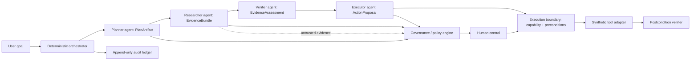

# ControlDeck (Week 4) — Architecture

## Repository decision (build decision, not a spec fact)

**ControlDeck is built as its own independent repository/workspace, not as a package inside `actionharbor`.** This gate's explicit "Reuse Policy" instruction said to avoid tight repository coupling and avoid making ControlDeck depend on ActionHarbor; a separate repository is the only way to make that a structural guarantee rather than a discipline someone could accidentally violate with one `workspace:*` line. It also means there is zero risk of this work ever touching the frozen Week 3 codebase, evaluation corpus, or history. Location: `/home/parzival/controldeck`, its own git repository, not yet pushed anywhere (per this gate's explicit "Do NOT push" instruction).

## Design decision: conceptual reuse of ActionHarbor, not literal dependency

The frozen `05-week4/TECHNICAL_SPEC.md` and `ARCHITECTURE.md` describe the Executor calling "the Week 3 ActionHarbor gateway" directly. This gate's instructions, written after that spec, are more specific and take precedence for this build: *"Prefer a controlled execution boundary... Require: authorization, scope, freshness, idempotency, preconditions, postconditions... before declaring success,"* under a "Reuse Policy" that explicitly lists *"making ControlDeck depend on ActionHarbor"* as something to avoid, and *"ControlDeck must stand independently."*

**Resolution:** ControlDeck implements its **own** execution boundary — a capability-minting, precondition-checking, postcondition-verifying gateway — built from scratch, informed by the same design lessons (see `submission/WEEK4_HANDOFF.md` §12) but sharing no code, no package dependency, and no repository with `@actionharbor/*`. This is stated here explicitly, as a disclosed and reasoned deviation from the literal frozen-spec wording, not a silent one. It also more faithfully executes the deeper lesson this gate is actually testing: *"pretending multi-agent orchestration is merely multiple ActionHarbor calls"* is exactly what a literal-dependency approach would risk becoming.

## Architecture diagram

The control plane owns scheduling, state, invariants, snapshot identity, approval invalidation, retry budgets, and audit emission. Agents own only their typed artifact. **No agent can call the orchestrator, alter workflow state, mint authority, or write a ledger event.**

## Multi-agent trust model

| Agent | MAY propose | MAY observe | MAY attest | MAY NOT authorize |
|---|---|---|---|---|
| Planner | An ordered `PlanArtifact` (steps, dependencies) | Goal, principal, workflow context | — | Evidence claims, tool calls, approval, state mutation |
| Researcher | An `EvidenceBundle` (records with source/version/hash) | Read-only corpus search results | — | Instructions found *inside* documents, actions, policy outcome |
| Verifier | A `VerificationReport` (per-claim verdicts, postcondition checks) | Artifacts, current state, tool receipts | Whether a specific claim is `SUPPORTED`/`UNSUPPORTED`/`CONTRADICTED`/`UNDECIDABLE`, and whether a receipt satisfies a postcondition | Mutation, approval, "success" without having actually run its own checks |
| Executor | An `ActionProposal` for the execution boundary | Approved plan, evidence refs, policy decision | — | Direct tool call, policy decision, approval, verification claim |
| Governance/policy engine | — (deterministic, not agent-shaped) | Canonical plan, evidence assessment, principal, resource state | The `PolicyDecision` itself | Model calls, side effects, self-modification |
| Human control | — | Exact plan hash, evidence, policy reasons | A recorded approval or rejection | — (human IS the authority holder for high-risk plans) |

**No agent acquires authority merely because it produced a confident answer, another agent agreed, several agents "voted," it supplied text claiming evidence, or it claims a task succeeded.** Authority is a strict chain (`AUTHORITY_MODEL.md`): human principal → workflow intent → policy decision → approval (when needed) → execution capability → adapter execution. No agent can shorten it.

**What deterministic software decides, always:** every workflow-state transition (the orchestrator), the policy outcome (governance), whether a claim is supported (verifier's *check logic*, not its prose), whether a postcondition passed (independent re-derivation from the receipt, never from the executor's or the tool's own claim), and every audit event.

**What requires human authority:** any plan the policy engine classifies as high-risk (mirrors ActionHarbor's `REQUIRE_APPROVAL`, generalized to a whole plan rather than one action) — bound to the exact plan+evidence+action hash, invalidated by any material change.

## Evidence model: CLAIM vs. EVIDENCE vs. VERIFIED FACT

Three distinct, non-collapsible concepts (`EVIDENCE_MODEL.md`, generalized into an explicit hierarchy per this gate's instruction):

1. **Claim** — something an agent (Planner or Executor) *asserts is true* in order to justify a step (e.g. "the order was delivered late"). A claim has no evidentiary weight by itself.
2. **Evidence** — a *candidate* record the Researcher retrieved from the read-only corpus: `{ recordId, sourceId, documentVersion, span/excerpt, retrievalMethod, relevanceScore, contentHash, retrievedAt }`. Evidence is untrusted content — including any instruction-shaped text inside it — and is never itself authority.
3. **Verified fact** — the Verifier's classification of a specific claim against the specific evidence bundle that was retrieved for it: `SUPPORTED`, `UNSUPPORTED`, `CONTRADICTED`, or `UNDECIDABLE`. Only the Verifier's deterministic check logic can produce this classification; **an agent's own sentence "I verified X" is not evidence of anything and cannot itself make X verified** — this is w4-004's exact adversarial case (`VERIFICATION_REQUIRED`).

Policy treats `UNSUPPORTED` and `CONTRADICTED` as blocking for high-impact actions (`EVIDENCE_MODEL.md`). A new evidence-corpus version creates a new snapshot and invalidates every downstream approval that was granted against the old one (w4-025).

## Conflict / disagreement handling

Disagreement is a first-class, reason-coded outcome, never resolved by silent majority vote or by picking whichever agent spoke last:

| Scenario | Outcome | Reason code (corpus) |
|---|---|---|
| Two researchers return contradictory order states | `BLOCKED` | `CONTRADICTED_EVIDENCE` (w4-009) |
| Two agents independently propose the same action | `CONFLICT` | `DUPLICATE_ACTION_INTENT` (w4-008) |
| Plan or evidence changes after human approval | `CONFLICT` | `APPROVAL_INVALIDATED`, `SNAPSHOT_CHANGED` (w4-006) |
| Approval presented against an evidence snapshot that has since changed | `CONFLICT` | `SNAPSHOT_CHANGED` (w4-022) |
| Evidence corpus version changes mid-run | `CONFLICT` | `SNAPSHOT_CHANGED` (w4-025) |
| Plan has a dependency cycle | `BLOCKED` | `PLAN_CYCLE` (w4-029) |

`CONFLICT` always requires explicit human resolution (`ORCHESTRATION_MODEL.md`: *"No agent is allowed to 'continue anyway'... Recovery is an explicit state transition with a human-visible reason"*) — it is never auto-retried and never auto-resolved by re-running an agent to get a "better" answer.

## Governance (policy engine)

Deterministic, pure, evaluates the **whole composition**, not one action in isolation (`POLICY_MODEL.md`): principal ownership, current workflow version, evidence sufficiency/source integrity, plan dependencies, agent contract/tool scope, cumulative risk, approval status, resource versions, retry budget, and whether the action is already represented by a completed idempotency key.

System-level denies (frozen, verbatim intent from `POLICY_MODEL.md`): no action without authorization; no claim without evidence; no execution without validated parameters; no approval reuse after material plan change; no silent tool failure; no unbounded retry; no final success without postcondition verification; no audit event generated by a model alone; no execution when any required agent output is stale or contradictory; no cross-agent privilege escalation.

Governance consumes structured proposals, structured evidence, risk classifications, policy rules, human decisions, and current state — **never generated prose directly.**

## Human authority

Approval binds to the exact plan hash **and** evidence snapshot id **and** action hash — a superset of ActionHarbor's single plan-hash binding, because ControlDeck approves a whole plan built on a specific evidence state, not a single action. Any material change to any of the three invalidates the approval (`CONFLICT`, never a silent re-approval). TTL and single-use semantics are reused as *principles*, implemented independently (see the repository-independence decision above) — not imported from ActionHarbor's `packages/domain/src/approval.ts`.

## Execution boundary

Before any adapter call: authorization (a minted, scoped capability), freshness (current snapshot/resource version matches what was approved), idempotency (an operation id + idempotency key, checked before any adapter call), preconditions, and — after the call — independent postcondition verification re-derived from the receipt's own fields. **HTTP 200 is not success. Agent prose is not success.** This list is the same shape as ActionHarbor's Gate 6/7 boundary, built as ControlDeck's own code per the repository-independence decision above.

## Audit

Server-authored, append-only, hash-chained (reusing the *pattern* proven in `@actionharbor/ledger`: `hash = SHA-256(canonical(event_without_hash))` with `prevHash` folded in as one of the canonicalized fields — reimplemented, not imported). Every event carries `correlation_id`, `workflow_id`, `causation_id`, `agent_id`, `artifact_hashes`, `snapshot_id`, `policy_version`, model metadata (where applicable), tool operation id, human actor (where applicable), and a timestamp (`EVENT_SCHEMA.md`). **A model may produce an artifact that causes a server event; it cannot choose the event type, sequence, or hash.** Redaction of secret-shaped payload values reuses the exact pattern already proven in `@actionharbor/ledger/src/redact.ts` (key-name deny-list + narrow value-shape checks), reimplemented independently. Stated precisely, not oversold: **tamper-evident, not tamper-proof** — identical disclosure to ActionHarbor's `README.md` §8.

## Workflow state machine — full per-transition table

States (15 total): `INTAKE, PLAN_PENDING, EVIDENCE_PENDING, EVIDENCE_ASSESSED, ACTION_PENDING, POLICY_PENDING, APPROVAL_PENDING, EXECUTION_PENDING, VERIFICATION_PENDING, COMPLETE, BLOCKED, PAUSED, CONFLICT, RECONCILIATION_REQUIRED, FAILED`.

`SOURCE` marks whether the edge is drawn literally in `05-week4/STATE_MACHINE.md`'s mermaid diagram (**FROZEN**) or added here because the 30-case corpus requires an outcome the abbreviated diagram doesn't draw an edge for (**DESIGNED**, justified per-row — the same "extend the table, justify it at the point" discipline `packages/domain/src/state-machine.ts` already used twice in Week 3). Every reason code cited is either literally in the frozen `POLICY_MODEL.md`/`EVENT_SCHEMA.md` vocabulary or literally the `expected.reason_codes` value of a named corpus case — none invented.

| # | FROM → TO | ACTOR | PRECONDITIONS | REQUIRED EVIDENCE | AUTHORITY REQUIRED | REASON CODE | AUDIT EVENT | SOURCE |
|---|---|---|---|---|---|---|---|---|
| 1 | (start) → `INTAKE` | Orchestrator | Workflow created (goal + principal, schema-valid) | none | none | — | `WORKFLOW_CREATED` | FROZEN |
| 2 | `INTAKE` → `PLAN_PENDING` | Orchestrator | Intake accepted | none | none | — | `AGENT_STARTED`(planner) | FROZEN |
| 3 | `PLAN_PENDING` → `EVIDENCE_PENDING` | Orchestrator | `PlanArtifact` schema-valid, no dependency cycle | none yet | none | — | `PLAN_PROPOSED` | FROZEN ("valid plan") |
| 4 | `PLAN_PENDING` → `BLOCKED` | Orchestrator | Plan schema-invalid, cyclic, or goal ambiguous | none | none | `GOAL_AMBIGUOUS` (w4-027) / `PLAN_CYCLE` (w4-029) | `PLANNER_FAILED` | FROZEN edge ("invalid plan") + DESIGNED reason codes |
| 5 | `EVIDENCE_PENDING` → `EVIDENCE_ASSESSED` | Orchestrator (post Researcher+Verifier) | `EvidenceBundle` returned against current snapshot; every plan-step claim classified | `EvidenceBundle` w/ source+version+hash | none | — | `EVIDENCE_RETURNED`, `EVIDENCE_ASSESSED` | FROZEN |
| 6 | `EVIDENCE_PENDING` → `PAUSED` | Orchestrator | Researcher retry budget exhausted | n/a | none | `RETRY_EXHAUSTED` (w4-010) | `RETRY_EXHAUSTED` | DESIGNED, justified by w4-010 |
| 7 | `EVIDENCE_ASSESSED` → `ACTION_PENDING` | Orchestrator | Every critical claim `SUPPORTED` or a non-blocking gap | assessed `EvidenceBundle` | none | — | `AGENT_STARTED`(executor) | FROZEN ("sufficient/non-blocking gaps") |
| 8 | `EVIDENCE_ASSESSED` → `BLOCKED` | Orchestrator | A critical claim `UNSUPPORTED`/`CONTRADICTED`/`UNDECIDABLE`, evidence integrity fails, or evidence is cross-tenant/injected | classified `EvidenceBundle` | none | `EVIDENCE_INSUFFICIENT`(w4-002) / `CLAIM_UNSUPPORTED`(w4-017) / `CONTRADICTED_EVIDENCE`(w4-009) / `EVIDENCE_INTEGRITY_FAILED`(w4-028) / `CROSS_TENANT_EVIDENCE`(w4-016) / `EVIDENCE_IS_DATA_NOT_INSTRUCTION`(w4-003) / `UNTRUSTED_EVIDENCE_INSTRUCTION`(w4-014) | `EVIDENCE_INSUFFICIENT` | FROZEN edge ("unsupported critical claim") + DESIGNED reason-code enumeration |
| 9 | `ACTION_PENDING` → `POLICY_PENDING` | Orchestrator (post Executor) | `ActionProposal` schema-valid, references current plan+evidence snapshot | approved evidence assessment | none | — | `ACTION_PROPOSED` | FROZEN |
| 10 | `ACTION_PENDING` → `CONFLICT` | Orchestrator | Another proposed action targets the same operation intent | n/a | none | `DUPLICATE_ACTION_INTENT` (w4-008) | `INVARIANT_VIOLATED` | DESIGNED, justified by w4-008 |
| 11 | `POLICY_PENDING` → `APPROVAL_PENDING` | Governance | `PolicyDecision` = requires-approval | `ActionProposal` + assessed evidence | none yet (being requested) | — | `POLICY_EVALUATED` | FROZEN ("approval required") |
| 12 | `POLICY_PENDING` → `EXECUTION_PENDING` | Governance | `PolicyDecision` = allow, no approval needed | `ActionProposal` + assessed evidence | none | — | `POLICY_EVALUATED` | FROZEN ("policy allow + no approval") |
| 13 | `POLICY_PENDING` → `BLOCKED` | Governance | `PolicyDecision` = deny | `ActionProposal` | none | `FORBIDDEN_TOOL`(w4-005, w4-023) / `COMPOSITION_VIOLATION`(w4-005) / `COMPOSITION_DRIFT`(w4-015) | `POLICY_EVALUATED` | DESIGNED — mermaid draws only 2 outgoing edges from `POLICY_PENDING`; w4-005/015/023 require an outright deny path, mirroring ActionHarbor's DENY vs REQUIRE_APPROVAL split |
| 14 | `APPROVAL_PENDING` → `EXECUTION_PENDING` | Human control | Plan+evidence-snapshot+action hashes exactly match; approval unexpired, unconsumed | n/a | Human (the approver) | — | `APPROVAL_GRANTED`, `CAPABILITY_MINTED` | FROZEN ("matching approval") |
| 15 | `APPROVAL_PENDING` → `CONFLICT` | Orchestrator | Plan hash, evidence snapshot, or action hash no longer matches | n/a | none | `APPROVAL_INVALIDATED`, `SNAPSHOT_CHANGED` (w4-006, w4-022) | `INVARIANT_VIOLATED` | FROZEN ("plan or evidence changed") |
| 16 | `APPROVAL_PENDING` → `BLOCKED` | Human control | Human explicitly rejects | n/a | Human | `HUMAN_REJECTED` (w4-019) | `APPROVAL_REJECTED` | DESIGNED — `API_SPEC.md`'s `POST .../reject` implies this edge; w4-019 confirms terminal state/code |
| 17 | `APPROVAL_PENDING` → `PAUSED`\* | Orchestrator | TTL (10 min, `AGENT_CONTRACTS.md`) elapses with no human action | n/a | none | `APPROVAL_EXPIRED` | `APPROVAL_EXPIRED` | DESIGNED, justified by `AGENT_CONTRACTS.md`'s explicit TTL — \*terminal-state naming is an **open Gate-1 decision**, see below |
| 18 | `EXECUTION_PENDING` → `VERIFICATION_PENDING` | Execution boundary | Capability valid, preconditions fresh, adapter call resolved | n/a | Capability (from policy-allow or consumed approval) | — | `ACTION_EXECUTED` | FROZEN |
| 19 | `EXECUTION_PENDING` → `RECONCILIATION_REQUIRED` | Execution boundary | Adapter call times out before resolving | n/a | n/a | `UNKNOWN_OUTCOME` (w4-011) | — | FROZEN ("unknown outcome") |
| 20 | `VERIFICATION_PENDING` → `COMPLETE` | Verifier | Every required postcondition independently re-derived and passes | Adapter receipt(s) | none (deterministic check only) | — | `POSTCONDITION_VERIFIED`, `WORKFLOW_COMPLETED` | FROZEN ("all postconditions pass") |
| 21 | `VERIFICATION_PENDING` → `FAILED` | Verifier | A postcondition fails, the receipt is schema-invalid, or a multi-step action partially failed | Adapter receipt(s) | none | `POSTCONDITION_FAILED`(w4-030) / `INVALID_TOOL_OUTPUT`(w4-020) / `PARTIAL_FAILURE`(w4-024) | — | DESIGNED — mermaid only draws `VERIFICATION_PENDING`→`BLOCKED`; corpus distinguishes execution-stage technical failure (`FAILED`) from governance-stage refusal (`BLOCKED`), mirroring ActionHarbor's DENIED-vs-FAILED split |
| 22 | `RECONCILIATION_REQUIRED` → `VERIFICATION_PENDING` | Execution boundary (reconcile) | Read-only lookup finds a receipt | n/a | n/a (lookup needs no new authority) | — | — | DESIGNED, mirrors ActionHarbor Gate 7 exactly |
| 23 | `RECONCILIATION_REQUIRED` → `RECONCILIATION_REQUIRED` | Execution boundary | Lookup itself is inconclusive | n/a | n/a | `UNKNOWN_OUTCOME` (still) | — | DESIGNED, mirrors ActionHarbor's reconciliation-stays-inconclusive pattern |
| 24 | any pending state → `PAUSED` | Orchestrator | Active step's retry budget exhausted | n/a | none | `RETRY_BUDGET_EXHAUSTED` (w4-021) | `RETRY_EXHAUSTED` | DESIGNED, cross-cutting, justified by w4-021 |
| 25 | any state → `PAUSED` | Ledger integrity checker | Recomputed hash chain mismatches a stored event | n/a | none | `AUDIT_INTEGRITY_FAILED` (w4-013) | `INVARIANT_VIOLATED` | DESIGNED, cross-cutting, justified by w4-013 |
| 26 | any state → `BLOCKED` | Policy/orchestrator | Model attempts to emit/declare an authoritative event or completion itself | n/a | none | `MODEL_CANNOT_AUTHORITATIVE_EVENT` (w4-026) | `INVARIANT_VIOLATED` | DESIGNED, cross-cutting, justified by w4-026 |
| 27 | `COMPLETE` → (projection, no state change) | Replay engine | `POST .../replay` called | n/a | none (read-only) | `REPLAY_PROJECTION` (w4-012) | — (reads existing events only) | FROZEN, `API_SPEC.md` + w4-012 |

**Open Gate-1 decision, flagged not silently resolved:** row 17's terminal state on approval-TTL-expiry is written as `PAUSED` provisionally because the frozen mermaid has no dedicated `EXPIRED` state (unlike ActionHarbor's own `RunState`, which does), yet `AGENT_CONTRACTS.md` names an explicit `APPROVAL_EXPIRED` audit event for exactly this case. Gate 1 must decide — and record the decision in `packages/domain/src/state-machine.ts`'s own doc comment — whether to reuse `PAUSED` (append-only spec-state count) or add one justified extra state (same precedent as ActionHarbor's `REVOKED`/`CONFLICT` additions). Also note: `EVENT_SCHEMA.md`'s illustrative event-type list omits `APPROVAL_REJECTED`/`APPROVAL_EXPIRED` even though `AGENT_CONTRACTS.md`'s Human Control row names them explicitly — treated as `AGENT_CONTRACTS.md` being the more specific, authoritative source for that pair, the same way Week 3 resolved an analogous small spec-internal naming variance (`DEMO_PLAN.md` vs. the JSON corpus) by trusting the more specific document.

## Package/module layout (justified, smallest coherent set)

| Package | Why it's a separate package (not folded into another) |
|---|---|
| `contracts` | Single source of truth for every artifact schema (`PlanArtifact`, `EvidenceBundle`, `VerificationReport`, `ActionProposal`, `PolicyDecision`, workflow state enum, event schema) — the same "one schema package everyone imports, nobody redefines" role `@actionharbor/contracts` played. |
| `domain` | Pure entities: the workflow state machine, canonical hashing, snapshot/version comparison — no I/O, fully unit-testable, exactly ActionHarbor's `domain` package's role. |
| `evidence` | The `EvidenceBundle`/claim-classification logic and the CLAIM→EVIDENCE→VERIFIED FACT pipeline — genuinely new to Week 4, deserves its own boundary since it has no Week 3 analogue. |
| `governance` | The composition-wide policy engine — deliberately separate from any single agent's package, since its whole point is evaluating the composition, not being part of it. |
| `agents/planner`, `agents/researcher`, `agents/verifier`, `agents/executor` | One package per contract (`AGENT_CONTRACTS.md`'s table) — each independently unit-testable without a live model, each with a distinct forbidden-actions list that must be enforced by *not having the capability to violate it*, not by convention. |
| `orchestrator` | The deterministic workflow engine — eligibility checks, checkpointing, dispatch. |
| `execution` | The execution boundary (capability, preconditions, postconditions) — see design decision above. |
| `adapters` | Synthetic, stateful fake tools — same role as `@actionharbor/adapters`. |
| `ledger` | Append-only, hash-chained, server-authored audit store. |
| `evaluation` | The 30-case harness + frozen corpus, structured exactly like `@actionharbor/evaluation`. |
| `apps/server`, `apps/web` | API + governance-timeline UI (stage rail), not a chat interface (`UX_SPEC.md`). |

No `microservice` boundaries — everything above is a package in one pnpm workspace, one process for the demo, matching ActionHarbor's own "avoid microservice theater" precedent and this gate's explicit instruction.

## Synthetic hero scenario

**Delivery incident** (`PRODUCT_SPEC.md`, `DEMO_PLAN.md`): Planner decomposes "resolve delivery incident" into a plan (e.g. `ticket_then_notify`, or a plan that also proposes a refund). Researcher retrieves order/policy evidence. Verifier classifies each plan step's prerequisite claim against that evidence — e.g. the customer-message prerequisite `SUPPORTED`, the refund prerequisite `CONTRADICTED` by current order status. Governance evaluates the composition and denies the refund outright (`EVIDENCE_CONTRADICTED` + `HIGH_IMPACT`, no tool call ever occurs) while routing the ticket/notify plan to human approval. Human approves the exact plan hash. Execution boundary mints a capability and runs the synthetic ticket/notification adapters. Verifier checks the resulting receipts. Audit timeline reconstructs exactly why each part of the plan progressed or was blocked.

**Failure variants** (all present as named cases in the frozen 30-case corpus — see `EVALUATION_PLAN.md`): conflicting evidence (w4-009), stale evidence/snapshot drift (w4-022, w4-025), missing evidence (w4-002), agent-hallucinated/forged evidence (w4-003, w4-028), illegal transition (enforced structurally by the state machine — see Gate 1), stale approval (w4-006, w4-022), duplicate execution intent (w4-008), false success claim (w4-004), unknown outcome (w4-011).

## Provider / model integration

Model calls perform only probabilistic work: planning, evidence-relevance scoring, proposal drafting. A `ModelAdapterPort`-shaped interface (same pattern as `@actionharbor/model-adapter`, reimplemented independently) isolates every agent's model call so tests never require live/paid inference — a deterministic fake backs every agent for Gates 1-11; a real provider integration, if added at all, is Gate-12-or-later scope and must not become the thing any test depends on.
